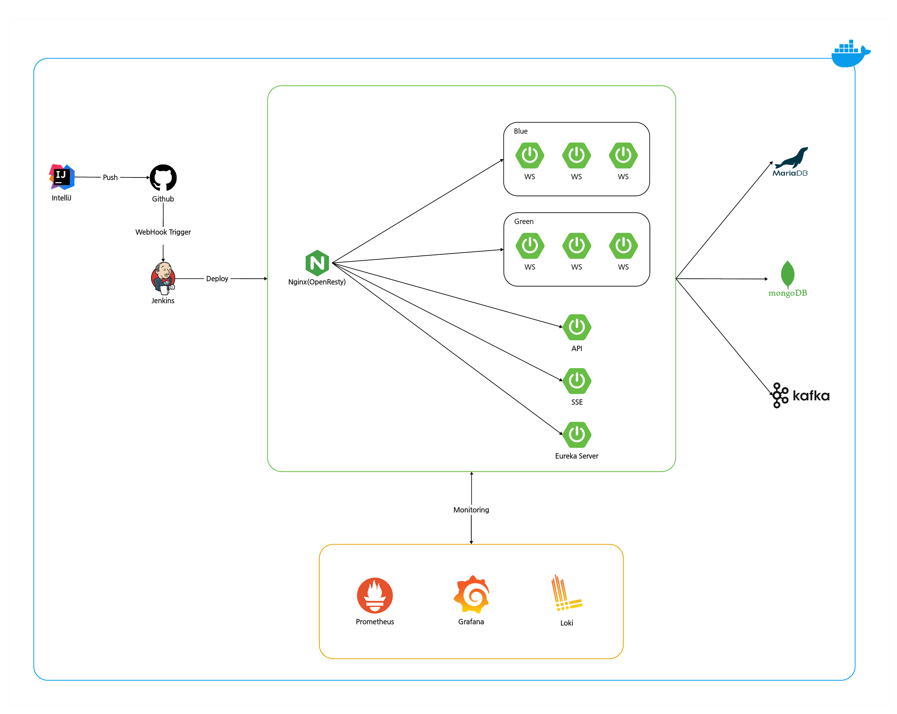
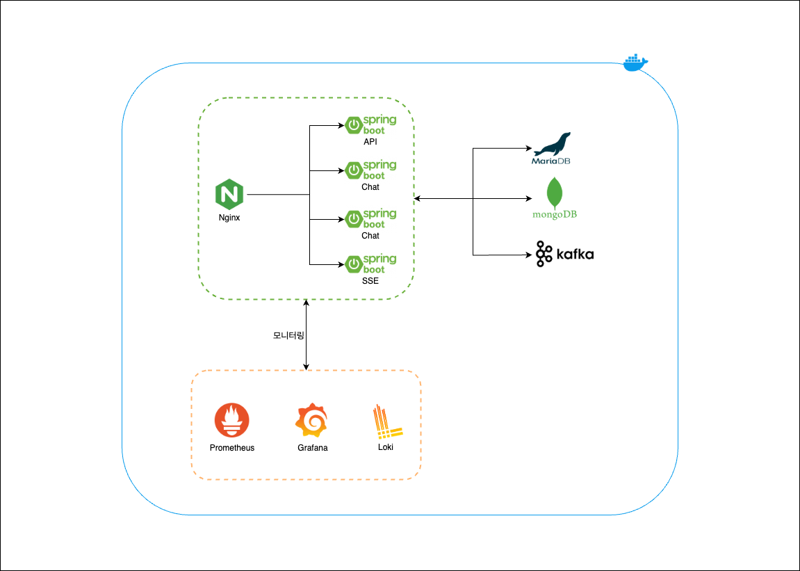
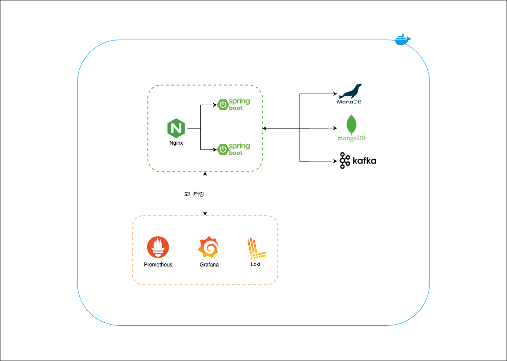
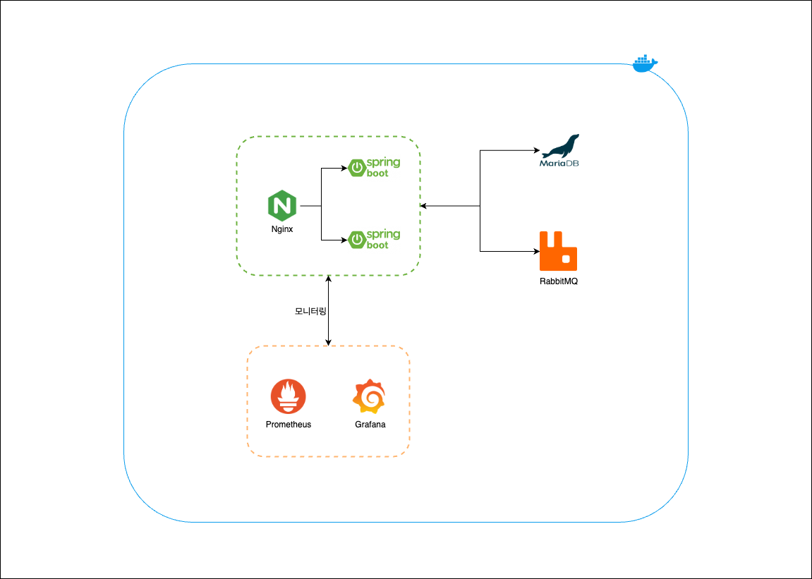
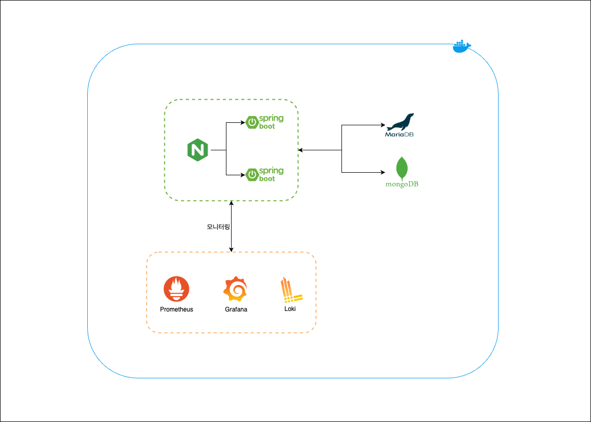
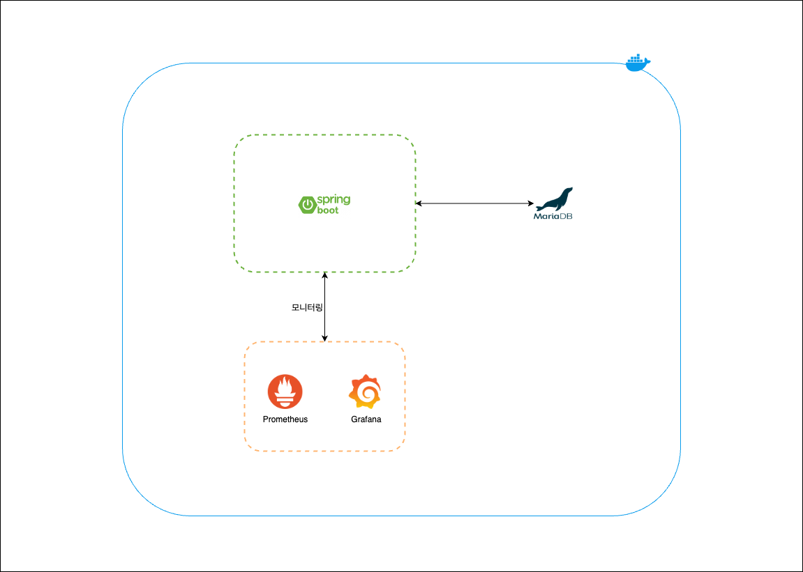

# Spring-10k-Chat-Server

## 📖 프로젝트 소개

- Spring Boot를 이용한 실시간 채팅 서버 구현 프로젝트입니다.
- 최종 목표는 10,000명의 사용자가 동시에 채팅을 할 수 있는 서버를 구현하는 것입니다.

---

## 🛠️ ️기술 스택

### Back-end

- Language: Kotlin 1.9.25
- Framework: Spring Boot 3.4.1, Spring WebFlux
- DB: MariaDB, MongoDB
- ORM: JPA, Querydsl
- WebSocket, STOMP
- Message Broker: RabbitMQ, Kafka

### Front-end

- Framework: React

---

## 주요 구현 내용

- 단체 채팅방 생성 및 입장
- 단체 채팅 기능
- 로그인/회원가입 기능 With JWT

---

## 🎥 Preview

---

## ⚙️ 인프라

 
 

v4.0 인프라

v3.0 인프라

v2.0 인프라

v1.5 인프라

v1.1 인프라

---

## 🗒️ 업데이트 내역

### v1.0

- 로그인/회원가입 With JWT
- 단체 채팅방 생성 및 목록 조회
- 단체 채팅 기능

### v1.1

- Prometheus, Grafana, Loki를 이용한 모니터링 구축
- Go 언어를 이용한 Stomp 부하 테스트 클라이언트 구현

### v1.5

- Nginx를 이용한 로드밸런싱 구축
- MongoDB를 이용한 채팅 메시지 저장

### v2.0

- RabbitMQ 연동
- 실시간 채팅 알림을 위한 SSE 서버 이중화 대응

### v3.0

- RabbitMQ -> Kafka 변경

### v4.0

- Multi Module 적용
- 채팅 관련 데이터 MariaDB -> MongoDB로 변경
- 채팅 내역 조회 시 무한 스크롤 적용
- SSE + WebFlux를 이용해 채팅 실시간 알림 구현

### v5.0

- OpenResty, Eureka Server, Jenkins를 통한 웹소켓 서버 Blue/Green 무중단 배포 구현

---

## 📝 블로그 정리

### 프로젝트 개발 일지

[Spring Boot 실시간 채팅 서버 구현 (1) - Stomp](https://woong99.tistory.com/25) 
[Spring Boot 실시간 채팅 서버 구현 (2) - WAS 이중화](https://woong99.tistory.com/27) 
[Spring Boot 실시간 채팅 서버 구현 (3) - MongoDB](https://woong99.tistory.com/28) 
[Spring Boot 실시간 채팅 서버 구현 (4) - RabbitMQ](https://woong99.tistory.com/29) 
[Spring Boot 실시간 채팅 서버 구현 (5) - WebSocket 무중단 배포](https://woong99.tistory.com/31) 

### 학습 내용

[AMQP란?](https://woong99.tistory.com/26) 

