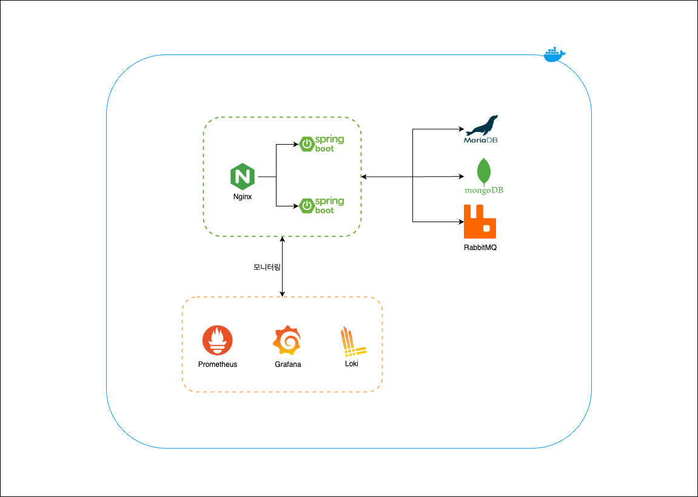

# Spring-10k-Chat-Server

## 📖 프로젝트 소개

- Spring Boot를 이용한 실시간 채팅 서버 구현 프로젝트입니다.
- 최종 목표는 10,000명의 사용자가 동시에 채팅을 할 수 있는 서버를 구현하는 것입니다.

---

## 🛠️ ️기술 스택

### Back-end

- Language: Kotlin 1.9.25
- Framework: Spring Boot 3.4.1
- DB: MariaDB
- ORM: JPA, Querydsl
- WebSocket, STOMP
- Message Broker: RabbitMQ

### Front-end

- Framework: React

---

## 주요 구현 내용

- 단체 채팅방 생성 및 입장
- 단체 채팅 기능
- 로그인/회원가입 기능 With JWT

---

## 🎥 Preview

---

## ⚙️ 인프라

 
 

v1.1 인프라

---

## 업데이트 내역

### v1.0

- 로그인/회원가입 With JWT
- 단체 채팅방 생성 및 목록 조회
- 단체 채팅 기능

### v1.1

- Prometheus, Grafana, Loki를 이용한 모니터링 구축
- 부하 테스트를 위한 K6 스크립트 작성

### v2.0

- RabbitMQ 연동
- 실시간 채팅 알림을 위한 SSE 서버 이중화 대응

